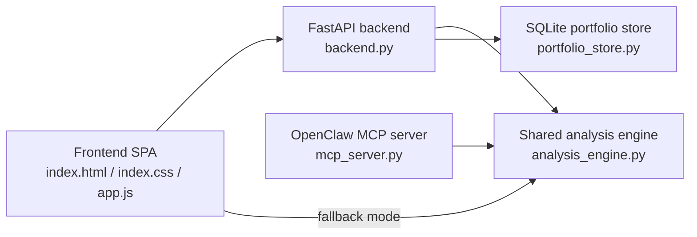

# QuantBrief v3

QuantBrief is a portfolio decision studio for Indian retail investors. It combines a bold single-page web app, a FastAPI analysis backend, and an OpenClaw MCP server so the same quant engine can power the UI, API, and chat tools.

It is designed to answer one question well:

**What should I do with this portfolio right now, and why?**

## What makes it different

- Decision-first UX instead of a dashboard full of passive charts
- Portfolio-aware market event scoring instead of generic market headlines
- One shared analysis engine for the frontend, backend, and MCP tools
- Graceful fallback mode when live market dependencies are unavailable
- Browser-local portfolio persistence plus SQLite-backed backend persistence
- Ready to run locally, easy to deploy to Render or Railway

## Product Snapshot

QuantBrief ships with four core surfaces:

1. **My Portfolio**: allocation ring, holdings table, portfolio editor, instant refresh
2. **Market Pulse**: ranked macro and sector events, institutional flows, exposure-aware context
3. **What To Do**: accumulate / hold / reduce lanes with clear reasoning
4. **Deep Analysis**: decision pipeline, correlation map, scenarios, model and risk signals

The current UI is intentionally cinematic and high-contrast, built for quick scanning on desktop and mobile without falling back to a generic finance template.

## Architecture



Exported diagram files:

- [docs/system-architecture.png](C:/Users/ASHWIN%20GOYAL/Downloads/QuantBrief-v3/docs/system-architecture.png)
- [docs/system-architecture.pdf](C:/Users/ASHWIN%20GOYAL/Downloads/QuantBrief-v3/docs/system-architecture.pdf)
- [docs/system-architecture.mmd](C:/Users/ASHWIN%20GOYAL/Downloads/QuantBrief-v3/docs/system-architecture.mmd)

## Core Capabilities

### Web Application

- Strong editorial-style interface with four views
- Interactive portfolio editor with add / remove / rebalance flow
- Confidence-led recommendation summary
- Allocation ring, scenario panel, correlation matrix, action lanes
- Keyboard shortcuts for tab switching
- Mobile bottom navigation and print-friendly export

### Backend API

- `GET /` serves the frontend
- `GET /api/health` returns engine and dependency status
- `GET /api/openclaw/status` reports gateway, workspace, and channel readiness
- `GET /api/stocks` lists supported Indian and US tickers
- `GET /api/portfolio` reads the persisted portfolio
- `PUT /api/portfolio` saves the persisted portfolio to SQLite
- `POST /api/analyze` runs full portfolio analysis

### OpenClaw / MCP

- `analyze_portfolio`
- `get_market_events`
- `lookup_stock`
- `get_recommendation`
- `get_risk_scenarios`
- `engine_status`

## Repository Layout

```text
QuantBrief-v3/
|-- analysis_engine.py   # Shared quant logic, events, scenarios, recommendations
|-- backend.py           # FastAPI server and API routes
|-- portfolio_store.py   # SQLite persistence for the active portfolio
|-- openclaw_status.py   # OpenClaw gateway, workspace, and channel status
|-- mcp_server.py        # OpenClaw MCP server
|-- index.html           # Frontend shell
|-- index.css            # Visual system and responsive styling
|-- app.js               # Frontend state, fallback engine, rendering, API integration
|-- portfolio.py         # Legacy portfolio utilities
|-- quant.py             # QuantStats wrapper
|-- requirements.txt     # Python dependencies
|-- openclaw.json        # OpenClaw workspace config
|-- Procfile             # Process entrypoint for hosted platforms
|-- render.yaml          # Render Blueprint
|-- railway.json         # Railway deployment config
|-- runtime.txt          # Python runtime pin
`-- skills/SKILL.md      # QuantBrief skill definition
```

## Quick Start

### 1. Install dependencies

```bash
pip install -r requirements.txt
```

### 2. Start the backend

```bash
python backend.py
```

Open [http://localhost:8000](http://localhost:8000).

## Running Modes

### Live mode

If `quantstats` and `yfinance` are installed and available, the backend will attempt to use live historical market data for analysis.

### Fallback mode

If those dependencies are missing, QuantBrief still works using the built-in scenario engine and simulated market profiles. This keeps the product usable during demos, offline work, or constrained environments.

The active mode is exposed through `GET /api/health` and surfaced in the UI.

## API Examples

### Health

```bash
curl http://localhost:8000/api/health
```

### Supported stocks

```bash
curl http://localhost:8000/api/stocks
```

### Analyze a portfolio

```bash
curl -X POST http://localhost:8000/api/analyze \
  -H "Content-Type: application/json" \
  -d '{
    "period": "3y",
    "aum": 2500000,
    "stocks": [
      { "ticker": "RELIANCE", "weight": 0.20 },
      { "ticker": "HDFCBANK", "weight": 0.18 },
      { "ticker": "TCS", "weight": 0.15 },
      { "ticker": "INFY", "weight": 0.12 },
      { "ticker": "ICICIBANK", "weight": 0.10 }
    ]
  }'
```

### Save the active portfolio

```bash
curl -X PUT http://localhost:8000/api/portfolio \
  -H "Content-Type: application/json" \
  -d '{
    "period": "3y",
    "aum": 2500000,
    "stocks": [
      { "ticker": "RELIANCE", "weight": 0.22 },
      { "ticker": "HDFCBANK", "weight": 0.18 },
      { "ticker": "TCS", "weight": 0.15 },
      { "ticker": "INFY", "weight": 0.13 },
      { "ticker": "ICICIBANK", "weight": 0.12 }
    ]
  }'
```

## OpenClaw Setup

The repository already includes an `openclaw.json` workspace configuration and a local skill.

### Start the backend

```bash
python backend.py
```

### Start the QuantBrief OpenClaw gateway

```powershell
openclaw --profile quantbrief gateway
```

### Run a local OpenClaw session

```powershell
$env:PYTHONIOENCODING="utf-8"
openclaw --profile quantbrief agent --local --session-id qb --message "How does my portfolio look?"
```

### Use WhatsApp with the linked personal account

QuantBrief is currently linked to your personal WhatsApp, but it is intentionally locked down to your own identity:

- `dmPolicy: "allowlist"`
- `allowFrom: ["+918097251640"]`
- `selfChatMode: true`
- `groupPolicy: "disabled"`

That means the safest supported flow is:

1. Keep the backend running.
2. Keep the QuantBrief gateway running with `openclaw --profile quantbrief gateway`.
3. Open your WhatsApp self-chat / message-yourself thread.
4. Send prompts there, for example:
   - `How does my portfolio look?`
   - `Should I buy HDFCBANK?`
   - `What is the biggest risk in my portfolio?`

### Example prompts

- `How does my portfolio look?`
- `Should I buy HDFCBANK?`
- `What is the biggest current risk in my portfolio?`
- `Show my stress-case downside`

## Deployment

### Render

This repo includes a ready-to-use `render.yaml`.

Recommended steps:

1. Push the repository to GitHub.
2. In Render, create a new Blueprint deployment from the repository.
3. Render will install `requirements.txt`, start `uvicorn`, and health check `/api/health`.

### Railway

This repo includes a `railway.json` that works with Nixpacks.

Recommended steps:

1. Push the repository to GitHub.
2. Create a new Railway project from the repository.
3. Railway will use the included start command and health check path.

## Known Constraints

- Free-tier Groq usage can rate-limit OpenClaw interactions.
- First-run warmup can be slower while optional quant dependencies initialize.
- WhatsApp is linked on the QuantBrief profile, but native Windows pairing/relink behavior can still be flaky on some OpenClaw builds.
- Telegram is plugin-enabled but not configured with a bot token yet.
- SQLite currently stores one active portfolio state, not full multi-user accounts.

## Recommended Next Steps

- Add user authentication and multi-portfolio storage
- Introduce real news sentiment ingestion
- Upgrade the ML layer beyond the current heuristic / lightweight model path
- Add richer test coverage around API contracts and scenario generation
- Ship hosted environments for public demos and stakeholder review

## Troubleshooting

### The UI loads but analysis is marked as simulated

Install the live-data dependencies:

```bash
pip install -r requirements.txt
```

Then restart the backend and check:

```bash
curl http://localhost:8000/api/health
```

### The first MCP call feels slow

The engine performs a warmup pass on startup. Keeping the backend and MCP server running avoids most of the cold-start cost.

### My portfolio changes disappear

The frontend stores state in local storage and the backend persists it in `quantbrief.db`. Make sure the app can reach the backend and that the working directory is writable.

## Disclaimer

QuantBrief is an educational decision-support tool. It is not investment advice, not a broker, and not a substitute for professional advice from a SEBI-registered advisor or equivalent licensed professional.
